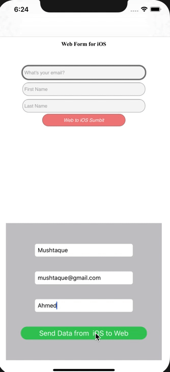
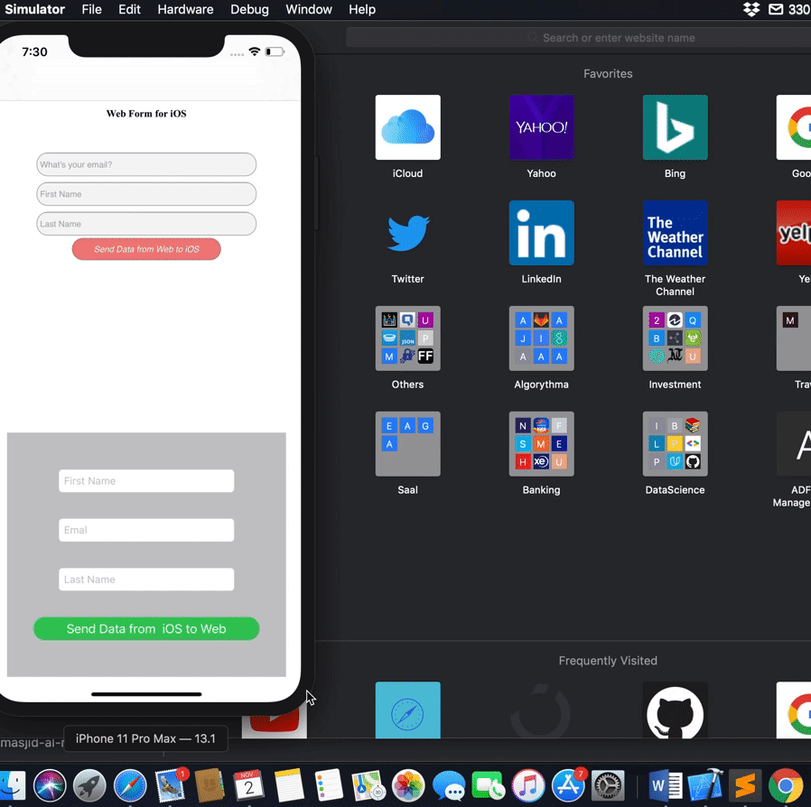

# WebKitDemo
Communication from iOS Native(Swift) to  Javascript/HTML page and back from Javascript/HTML to iOS Native 

 

Please find the detailed article and code explanation on my medium article.

https://medium.com/@mushtaque87/webkit-4bd5cf3dc08
